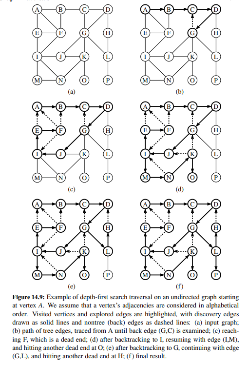
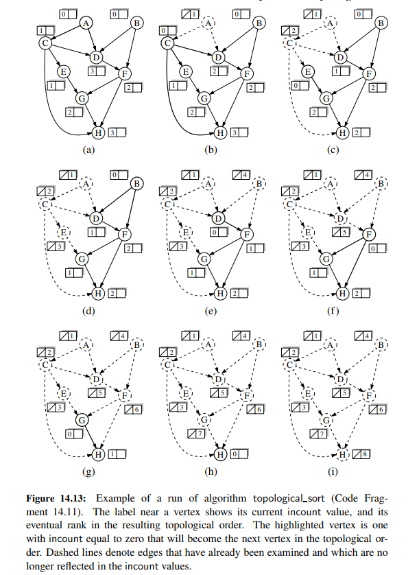

# Chapter 14 Graph Algorithms

A graph is a way of representing relationships that exist between pairs of objects.
That is, a graph is a set of objects, called vertices, together with a collection of
pairwise connections between them, called edges. Graphs have applications in
modeling many domains, including mapping, transportation, computer networks,
and electrical engineering.


Here's an interesting book on graphs and algorithms [Graphes et algorithmes, by Michel Minoux and Michel Gondran](https://www.amazon.fr/Graphes-algorithmes-Michel-Gondran/dp/2743010355).


## Properties of Graphs

A graph G = (V, E) consists of a set V of vertices and a set E of edges, where each edge is a pair (v, w) of vertices.
We have the following definitions:

- Two vertices v and w are adjacent if an edge (v, w) ∈ E.
- An edge e is incident on a vertex v if e = (v, w) for some vertex w ∈ V.
- The degree of a vertex v, denoted deg(v), is the number of edges incident on v.
- The in-degree of a vertex v, denoted indeg(v), is the number of incoming edges incident on v.
- The out-degree of a vertex v, denoted outdeg(v), is the number of outgoing edges incident on v.
- A path in G is a sequence of vertices $v_0, v_1, . . . , v_k$ such that $(v_i, v_{i+1}) ∈ E$ for $0 ≤ i < k$.
- A path is simple if all vertices in the path are distinct.
- A cycle in a graph G = (V, E) is a sequence of vertices $v_0, v_1, . . . , v_k$ such that $(v_i, v_{i+1}) ∈ E$ for $0 ≤ i < k$, and $v_0 = v_k$.
- A graph is connected if there is a path from every vertex to every other vertex.
- A graph is acyclic if it has no cycles.
- A graph is a tree if it is acyclic and connected.
- A graph is a forest if it is acyclic.
- A graph is directed if each edge has an associated direction. That is, an edge e = (v, w) is directed from v to w.
- A directed graph is strongly connected if there is a directed path from every vertex to every other vertex.
- A directed graph is weakly connected if replacing all of its directed edges with undirected edges produces a connected undirected graph.
- A spanning subgraph of G is a subgraph G' = (V', E') such that G' contains every vertex in V and a subset of the edges in E.
- If G is not connected, then its connected components are the maximal connected subgraphs of G.
- A spanning tree of G is a spanning subgraph of G that is a tree.

Here's some properties of graphs:

If G = (V, E) is a graph with n vertices and m edges, then the following properties hold:

- $\sum_{v \in V} deg(v) = 2m$
- $\sum_{v \in V} indeg(v) = \sum_{v \in V} outdeg(v) = m$
- Let G be a simple graph with n vertices and m edges. If G is undirected, then $m ≤ n(n − 1)/2$. If G is directed, then $m ≤ n(n − 1)$.

## Graph ADT

It is possible to model the abstraction of a graph using three data types: `Graph`, `Vertex`, and `Edge`.

An `Edge` supports the following methods:

- `endpoints()`: Return a tuple (u, v) for the vertices u and v that are endpoints of this edge.
- `opposite(v)`: Return the vertex that is opposite v on this edge.

The `Graph` ADT supports the following methods:

- `vertex_count()`: Return the number of vertices in the graph.
- `vertices()`: Return an iteration of all vertices of the graph.
- `edge_count()`: Return the number of edges in the graph.
- `edges()`: Return an iteration of all edges of the graph.
- `get_edge(u, v)`: Return the edge from u to v, or None if they are not adjacent.
- `degree(v, out=True)`: For an undirected graph, return the number of edges incident to vertex v. For a directed graph,
if out is True, return the number of outgoing edges from vertex v; otherwise return the number of incoming edges to vertex v.
- `incident_edges(v, out=True)`: For an undirected graph, return an iteration of all edges incident to vertex v. For a directed graph,
if out is True, return an iteration of all outgoing edges from vertex v; otherwise return an iteration of all incoming edges to vertex v.
- `insert_vertex(x=None)`: Insert and return a new Vertex with element x.
- `insert_edge(u, v, x=None)`: Insert and return a new Edge from u to v with auxiliary element x.
- `remove_vertex(v)`: Remove vertex v and all its incident edges from the graph.
- `remove_edge(e)`: Remove edge e from the graph.

## Graph Data Structures

Here's 4 ways to represent a graph:

- **edge list**: A list of all edges in the graph. This is not an efficient way to locate a specific edge (u, v) ∈ E or set
of edges incident on a vertex v ∈ V.
- **adjacency list**: We maintain, for each vertex, a separate list containing those edges that are incident to the vertex.
- **adjacency map**: similar to adjacency list, but we use a map to associate each vertex with its incident edges. This allows us to
quickly locate the edge (u, v) ∈ E, if it exists.
- **adjacency matrix**: We represent the graph as a two-dimensional matrix, such that the entry at row u and column v stores the number
of edges from u to v. For an unweighted graph, we use a 0-1 matrix, where the entry at row u and column v is 1 if there is an edge from u to v,
and 0 otherwise. For a weighted graph, we use a matrix of real numbers, where the entry at row u and column v stores the weight of the edge from u to v.

## Performance of Graph Representations

Here's the table of performance of the 4 representations:

| Operation | Edge List | Adjacency List | Adjacency Map | Adjacency Matrix |
| --- | --- | --- |---------------| --- |
| `vertex_count()` | $O(1)$ | $O(1)$ | $O(1)$        | $O(1)$ |
| `vertices()` | $O(n)$ | $O(n)$ | $O(n)$        | $O(n)$ |
| `edge_count()` | $O(1)$ | $O(1)$ | $O(1)$        | $O(1)$ |
| `edges()` | $O(m)$ | $O(m)$ | $O(m)$        | $O(n^2)$ |
| `get_edge(u, v)` | $O(m)$ | $O(min(deg(u), deg(v)))$ | $O(1)$        | $O(1)$ |
| `degree(v)` | $O(m)$ | $O(1)$ | $O(1)$        | $O(n)$ |
| `incident_edges(v)` | $O(m)$ | $O(deg(v))$ | $O(deg(v))$        | $O(n)$ |
| `insert_vertex(x)` | $O(1)$ | $O(1)$ | $O(1)$        | $O(n^2)$ |
| `insert_edge(u, v, x)` | $O(1)$ | $O(1)$ | $O(1)$        | $O(1)$ |
| `remove_vertex(v)` | $O(m)$ | $O(deg(v))$ | $O(deg(v))$        | $O(n^2)$ |
| `remove_edge(e)` | $O(m)$ | $O(1)$ | $O(1)$        | $O(1)$ |


| Representation | Space Complexity |
| --- |------------------|
| Edge List | $O(n+m)$         |
| Adjacency List | $O(n + m)$       |
| Adjacency Map | $O(n + m)$       |
| Adjacency Matrix | $O(n^2)$         |

## Graph Traversals

Formally, a traversal is a systematic procedure for exploring a graph by examining all of its vertices and edges. 
A traversal is efficient if it visits all the vertices and edges in time proportional to their number, that is, in linear time.

Graph traversal algorithms are key to answering many fundamental questions
about graphs involving the notion of reachability, that is, in determining how to
travel from one vertex to another while following paths of a graph.

### Depth-First Search

Depth-first search (DFS) is a graph traversal algorithm that explores edges out of the most recently discovered vertex v
that still has unexplored edges leaving it. Once all of v’s edges have been explored, the search “backtracks” 
to explore edges leaving the vertex from which v was discovered. This process continues until we have discovered 
all the vertices that are reachable from the original source vertex. If any undiscovered vertices remain, 
then depth-first search selects one of them as a new source, and it repeats the search from that source. 
The algorithm repeats this entire process until it has discovered every vertex.


Here's the pseudocode for DFS:

```text
Algorithm DFS(G, u):  {we assume u has already been discovered}
    Input: Graph G and vertex u of G
    Output: A collection of vertices of G reachable from u in G
    
    for each outgoing edge e = (u, v) of u do
        if vertex v is not yet discovered then
            Mark v as discovered (via edge e)
            recursively call DFS(G, v)
```

Example of execution:



**Some observations:**

- Let G be an undirected graph on which a DFS traversal starting at a vertex s has been performed. Then the traversal visits all vertices in the
connected component of s, and the discovery edges form a spanning tree of the connected component of s.
- Let G be a directed graph on which a DFS traversal starting at a vertex s has been performed. Then the traversal visits all vertices that are
reachable from s, and the discovery edges form a spanning tree of the reachable portion of G.

**Some properties:**

- The running time of DFS is $O(n + m)$, where n is the number of vertices and m is the number of edges. 

### Breadth-First Search

Breadth-first search (BFS) is a graph traversal algorithm that explores edges out of the source vertex s in “levels”.
BFS starts at vertex s, which is at level 0. In the first round, we paint as “visited,” all vertices
adjacent to the start vertex s—these vertices are one step away from the beginning
and are placed into level 1. In the second round, we allow all explorers to go
two steps (i.e., edges) away from the starting vertex. These new vertices, which are adjacent to level 1 vertices 
and not previously assigned to a level, are placed into level 2 and marked as “visited.” This process continues 
in similar fashion, terminating when no new vertices are found in a level.


- Pseudocode for BFS:

```text
Algorithm BFS(G, s, discovered):
    Input: Graph G = (V, E), vertex s ∈ V , and a set discovered ⊆ V of already discovered vertices
    Output: A BFS tree rooted at s
    
    level = [s] {first level includes only s}
    while level is not empty do
        next_level = [ ]
        for each vertex u ∈ level do
            for each edge (u, v) ∈ E do
                if vertex v is not discovered then
                    discover vertex v
                    add vertex v to next_level
        level = next_level
```

BFS algorithm has the following properties:

- The traversal visits all vertices that are reachable from s (the start vertex).
- For each vertex v at level i, the path of the BFS tree T between s and v has i edges, and any other path between s and v in G contains at least i edges.
- If (u, v) is an edge that is not in the BFS tree T, then the level number of v can be at most one more than the level number of u.
- Let G be a graph with n vertices and m edges. Then the running time of BFS is $O(n + m)$.


## Transitive Closure

DFS and BFS algorithms can be used to answer basic reachability questions in a directed graph. If we are interested in knowing whether yes or no,
there is a path from vertex u to vertex v, we can simply run a DFS or BFS starting at u and see if v is discovered.

In certain applications, we may wish to answer many reachability queries more  efficiently, in which case it may be 
worthwhile to precompute a more convenient representation of a graph.
For example, the first step for a service that computes driving directions from an origin to a destination might be 
to assess whether the destination is reachable. Similarly, in an electricity network, we may wish to be able to quickly 
determine whether current flows from one particular vertex to another.

The transitive closure of a directed graph G = (V, E) is another directed graph G* = (V, E*) such that for all 
vertices u and v in V, we have an edge (u, v) in E* if and only if there is a path from u to v in G.


If G is represented as adjacency list  or adjacency map, we can compute its transitive closure in $O(n+m)$ time by making
use of n graph traversals, one for each vertex in G. 

Computing a transitive closure for a graph represented as an adjacency matrix is more challenging as this data structure
support a constant time for get_edge(u, v) operation. 

* Properties

For $i=0,1,...,n-1,n$, directed graph $G_k$ has an edge $(v_i, v_j)$ if and only if directed graph G has a path from $v_i$ to $v_j$, 
whose intermediate vertices (if any) are all in the set $\{v_0, v_1, ..., v_k\}$. In particular $G_n$ is the transitive closure of G noted $G^*$.

A simple algorithm to compute the transitive closure of a graph G is known as the Floyd-Warshall algorithm.

- Pseudocode for Floyd-Warshall algorithm:

```text
Algorithm FloydWarshall(G):
    Input: A directed graph G with n vertices
    Output: The transitive closure $G^*$ of G
    
    let $v_0, v_1, ..., v_n$ be an arbitrary numbering of the vertices of G
    $G_0$ = G
    
    for k = 1 to n do
        $G_k$ = $G_{k-1}$
        for all i, j in {0, 1, ..., n} do
            if both edge $(v_i, v_k)$ and edge $(v_k, v_j)$ are in $G_{k-1}$ then
                add edge $(v_i, v_j)$ to $G_k$ {if not already there}
    return $G_n$
```

This algorithm runs in $O(n^3)$ time if the get_edge(u, v) operation takes constant time.

Although DFS is asymptotically faster (compute the transitive closure in $O(n(m+n))$ time) than Floyd-Warshall, the latter is often preferred in practice because it is easier to implement and
it is more efficient for sparse graphs.


## Directed Acyclic Graphs

A directed acyclic graph (DAG) is a directed graph that contains no cycles. Such graphs arise in many applications,
including scheduling, task assignment, and genealogical relationships.


### Topological Ordering

Let G be a directed graph with n vertices. A topological ordering of G is an ordering $v_1, v_2, ..., v_n$ of the vertices of G such that
for every edge $(v_i, v_j)$ in G, we have $i < j$. That is, each vertex precedes all of its successors in the ordering.
A directed graph may have many topological orderings, or none at all. 

**A topological ordering of a directed graph G is possible if and only if G is a DAG.**

It's easy to prove the "only if" statement by contradiction. Suppose that G is topologically ordered, and that there is a cycle in G.
For the sake of contradiction, let $v_1, v_2, ..., v_k$ be a cycle in G, where $v_1 = v_k$. Then, by the definition of a topological ordering,
we have $1 < 2 < ... < k$, and $k < 1$, a contradiction.

Now, let's prove the "if" statement. Suppose that G is a DAG, G must have a vertex v1 that has no incoming edges. 
We can remove v1 and all of its outgoing edges from G to obtain a new directed graph G'. G' is also a DAG, and it has a vertex v2 that has no incoming edges.
We can remove v2 and all of its outgoing edges from G' to obtain a new directed acyclic graph G''. 
We can continue this process until we have removed all vertices from G.
Because G is finite, this process must terminate, and the resulting sequence of vertices $v_1, v_2, ..., v_n$ is a topological ordering of G as 
$v_i$ must precede $v_j$ for all edges $(v_i, v_j)$ in G thus $i < j$.


### Topological Sort

A topological sort of a directed acyclic graph G = (V, E) is a linear ordering of all its vertices such that if G contains an edge (u, v),
then u appears before v in the ordering. A topological sort of a DAG G is possible if and only if G has a topological ordering.

- Pseudocode for topological sort:

```text
Algorithm TopologicalSort(G):
    Input: A directed acyclic graph G = (V, E)
    Output: A topological ordering of G
    
    topo = [ ] {list of vertices placed in topological order}
    ready = [ ] {list of vertices that have no remaining constraints}
    incount = {map keeping track of remaining in-degrees for each vertex}
    for each vertex v in V do
        incount[v] = indegree(v)
        if incount[v] == 0 then
            ready.add(v)
    while ready is not empty do
        u = ready.removeFirst()
        topo.add(u)
        for each vertex v with an edge (u, v) do
            incount[v] -= 1
            if incount[v] == 0 then
                ready.add(v)
    return topo
```

Example of execution:



**Properties**

- Let G be a directed graph with n vertices and m edges, using an adjacency list representation. Then, a topological sort of G can be computed in $O(n + m)$ time 
with $O(n)$ auxiliary space. If G is a DAG, then the algorithm returns a topological sort of G. If G is not a DAG, then the algorithm returns an incomplete topological sort of G
 which indicates that G has a directed cycle.

## Shortest Paths

### Weighted Graphs

A weighted graph is a graph in which each edge has an associated weight, which is a real-valued number.
In some cases, it is not appropriate to treat all edges as having the same cost. For example, in a road network,
the cost of an edge might be the distance between the two vertices it connects. In a computer network, the cost of an edge might be the
latency between the two vertices it connects.

Formally, a weighted graph G = (V, E) is a graph in which each edge e ∈ E has an associated real-valued weight w(e).


### Shortest Path in a Weighted Graph

Let G = (V, E) be a weighted graph with weight function w : E → R. The weight of a path p = (v0, v1, ..., vk) in G is the sum of the weights of its edges:

$$w(p) = \sum_{i=1}^{k} w(v_{i-1}, v_i)$$

The distance d(u, v) between two vertices u and v is the length of a **shortest path** between them.
If there is no path between u and v, then d(u, v) = ∞.
However, if G contains a negative-weight cycle, then the shortest path between some pair of vertices may not be well defined.

Suppose we are given a weighted graph G, and we are asked to find a shortest path from some vertex s to each other 
vertex in G, viewing the weights on the edges as distances. In this section, we explore efficient ways of finding all 
such shortest paths, if they exist. The first algorithm we discuss is for the simple, yet common, case when all the 
edge weights in G are non-negative (that is, w(e) ≥ 0 for each edge e of G); hence, we know in advance that there are no negative-weight cycles in G.
Recall that the special case of computing a shortest path when all weights are equal to one was solved with the BFS traversal algorithm.

There's an interesting approach for solving this **single-source** problem based on the ***greedy method*** design pattern.
Recall that a greedy algorithm always makes the choice that looks best at the moment. That is, it makes a locally 
optimal choice in the hope that this choice will lead to a globally optimal solution.

#### Dijkstra's Algorithm

The main idea in applying the greedy method pattern to the single-source shortest-path problem is to perform a 
“weighted” breadth-first search starting at the source  vertex s. In particular, we can use the greedy method 
to develop an algorithm that iteratively grows a “cloud” of vertices out of s, with the vertices entering the cloud
in order of their distances from s. Thus, in each iteration, the next vertex chosen is the vertex outside the cloud 
that is closest to s. The algorithm terminates when no more vertices are outside the cloud (or when those outside the 
cloud are not connected to those within the cloud), at which point we have a shortest path from *s* to every vertex of G
that is reachable from s. This approach is a simple, but nevertheless powerful, example of the greedy method design pattern. Applying the
greedy method to the single-source, shortest-path problem, results in an algorithm known as **Dijkstra’s algorithm**.


- Edge Relaxation

Let's define a label $D[v]$ for each vertex v in V, which we use to approximate the distance in G from s to v.
Initially, we set $D[s] = 0$, and for each vertex v ≠ s, we set $D[v] = ∞$. Let's define the set C, which is the set of vertices
initially empty. At each step, we grow the set C by one vertex, and we maintain the invariant that $D[v]$ is the length 
of the shortest path from s to v for each vertex v ∈ C. This update operation is known as **edge relaxation**.
Formally, edge relaxation is defined as follows:

$$D[v] = min(D[v], D[u] + w(u, v))$$

where $u$ is the predecessor of $v$ in the shortest path from $s$ to $v$.

- Pseudocode for Dijkstra's algorithm:

```text
Algorithm Dijkstra(G, s):
    Input: A weighted graph G = (V, E) with weight function w : E → R and a distinguished source vertex s
    Output: A label D[u] for each vertex u such that D[u] is the length of a shortest path from s to u in G
    
    for each vertex v in V do
        D[v] = ∞
    D[s] = 0  {initialize the source path length to 0}
    S = [ ] {S is the set of explored vertices}
    Q = V {Q is a priority queue of vertices, using the D labels as keys}
    while Q is not empty do
        u = Extract-Min(Q)
        S.add(u)
        for each vertex v adjacent to u such that v is in Q do
            if D[v] > D[u] + w(u, v) then
                D[v] = D[u] + w(u, v)
                change priority of v to D[v] in Q
```

**Properties**

In Dijkstra's algorithm, whenever a vertex is pulled into the cloud, the label $D[v]$ is equal to the length of a shortest path from s to v ($d(s, v)$).

- The running time of Dijkstra's algorithm is $O((n + m)logn)$, where n is the number of vertices and m is the number of edges in the graph.
Of course this running time assumes that the priority queue Q supports the operations Extract-Min and Change-Priority 
in $O(logn)$ time and the graph G is represented using an adjacency list or adjacency map.

Note that if the graph is dense, then m = $O(n^2)$, and the running time of Dijkstra's algorithm is $O(n^2logn)$.

If Q is an adaptable priority queue using an unsorted sequence, then the running time of Dijkstra's algorithm is $O(n^2)$
in the worst case.

We can decide to implement Dijkstra's algorithm using a binary heap as the priority queue Q. In this case, the running 
time of Dijkstra's algorithm is $O((n + m)logn)$, or we can use an unsorted sequence as the priority queue Q, 
in which case the running time is $O(n^2)$.

> Note that an advanced priority queue data structure known as a **Fibonacci heap** can be used to implement Dijkstra's
algorithm in $O(nlogn + m)$ time.


## Minimum Spanning Trees

Rather that computing a shortest-path tree from some particular vertex s, we may wish to compute a tree that contains all
vertices of the graph and has minimum total weight among all such trees. Such a tree is called a **minimum spanning tree**.

**Problem definition**

Given an undirected graph G = (V, E) with non-negative edge weights, we are interested in finding a tree T that contains all vertices of G
and minimizes the sum
$$\sum_{e \in T} w(e)$$
where w(e) is the weight of edge e.

T is called a minimum spanning tree of G.


**Properties**

Let G be a weighted connected graph, and let $V_1$ and $V_2$ be a partition of V such that $V_1 \cup V_2 = V$ and $V_1 \cap V_2 = \emptyset$.
Let e = (u, v) be a minimum-weight edge that connects a vertex in $V_1$ to a vertex in $V_2$. Then, there is a minimum spanning tree of G that contains e.

Easy to prove by contradiction. Suppose that T is a minimum spanning tree of G that does not contain e. Then, T contains a path p from u to v.
Because e is the minimum-weight edge that connects a vertex in $V_1$ to a vertex in $V_2$, there must be an edge f = (x, y) on p such that x ∈ $V_1$ and y ∈ $V_2$.
We can replace f with e to obtain a spanning tree T' of G such that $w(T') < w(T)$, a contradiction.

### Prim-Jarnik Algorithm

The Prim-Jarnik algorithm is a greedy algorithm that computes a minimum spanning tree for a weighted undirected graph.
The main idea is similar to that of Dijkstra’s algorithm. We begin with some vertex s, defining the initial “cloud” of
vertices C. Then, in each iteration, we choose a minimum-weight edge e = (u, v) such that u ∈ C and v ∉ C, and we add v to C.
We continue until all vertices are in C. The resulting tree is a minimum spanning tree.

- Pseudocode for Prim-Jarnik algorithm:

```text
Algorithm PrimJarnik(G):
    Input: A weighted connected graph G = (V, E) with non-negative edge weights
    Output: A minimum spanning tree defined by the edges in T
    
    Pick an arbitrary vertex s to start the tree from
    D[s] = 0
    for each vertex v in V - {s} do
        D[v] = ∞
    Initialize T to be empty
    Initialize a priority queue Q of vertices, using the D labels as keys and (v, None) as values
    
    while Q is not empty do
        (u,e) = value returned by Q.remove_min()
        connect u to T via edge e
        for each edge e'=(u, v) such that v is in Q do
            if w(e') < D[v] then
                D[v] = w(e')
                change priority of v to D[v] in Q
                change value of v to (v, e') in Q
    return the tree T
```

### Kruskal's Algorithm

The Kruskal's algorithm is a greedy algorithm that computes a minimum spanning tree for a weighted connected graph.
Initially, each vertex is by itself in a singleton cluster. The algorithm then considers each edge in turn, ordered
by increasing weight. For each edge e = (u, v), if u and v are in different clusters, then the algorithm merges the two clusters
into a single cluster. The algorithm terminates when all vertices are in the same cluster.

- Pseudocode for Kruskal's algorithm:

```text
Algorithm Kruskal(G):
    Input: A simple connected weighted graph G with n vertices and m edges
    Output: A minimum spanning tree defined by the edges in T
    
    for each vertex v in G do
        Define an elementary cluster C(v) = {v}.
    Initialize a priority queue Q of edges, using the weights as keys.
    Initialize T to be empty.
    
    while T has fewer than n - 1 edges do
        (u, v) = value returned by Q.remove_min()
        Let C(u) be the cluster containing u, and let C(v) be the cluster containing v.
        if C(u) != C(v) then
            Add edge (u, v) to T
            Merge clusters C(u) and C(v)
    return the tree T
```

## Disjoint Partitions and Union-Find Structures

A **partition** of a set S is a collection of disjoint subsets of S whose union is S. For example, the set {1, 2, 3, 4, 5, 6} has the following partitions:

- {{1, 2, 3, 4, 5, 6}} (the trivial partition)
- {{1}, {2}, {3}, {4}, {5}, {6}} (the singleton partition)
- {{1, 2, 3}, {4, 5, 6}} (a partition into two subsets)
- {{1, 2}, {3, 4}, {5, 6}} (a partition into three subsets)
- {{1, 2, 3, 4}, {5, 6}} (a partition into two subsets)
- ...

A partition data structure manages a universe of elements that are organized into disjoint sets (that is, an element 
belongs to one and only one of these sets). 
Unlike with the set ADT or Python's set class, we do not expect to be able to iterate through the contents of a set, nor
to efficiently test whether a given set includes a given element.
Maybe we should use the term **groups** instead of sets to avoid confusion.

To make distinction between groups we assume that at any point in time, each group has a designated entry that we refer
to as the ***leader*** of the group.

Formally, a partition data structure supports the following methods:

- `make_group(x)`: Create a singleton group containing the element x, and return the position storing x.
- `union(p, q)`: Merge the groups containing elements at positions p and q.
- `find(p)`: Return the position of the group containing element p.


**Sequence implementation**

A simple implementation of a partition with a total of n elements uses a collection
of sequences, one for each group, where the sequence for a group A stores element
positions. Each position object stores a variable, element, which references its
associated element x and allows the execution of an *element()* method in $O(1)$ time.
In addition, each position stores a variable, group, that references the sequence
storing p, since this sequence is representing the group containing p’s element.

When using the sequence implementation:,
- the running time of the make_group(x) operation is $O(1)$, 
- the running time of the find(p) operation is $O(1)$, and
- the running time of the union(p, q) operation is $O(n)$.
- the running time of series of k make_group, find, and union operations on an initially empty partition is $O(k + n\log n)$.

**Tree-based implementation**

An alternative data structure for representing a partition uses a collection of
trees to store the n elements, where each tree is associated with a different group.

In particular, we implement each tree with a linked data structure whose nodes are themselves the group position objects. We view each position
p as being a node having an instance variable, element, referring to its element x,
and an instance variable, parent, referring to its parent node. By convention, if p is
the root of its tree, we set p’s parent reference to itself.

With this partition data structure, operation find(p) is performed by walking
up from position p to the root of its tree, which takes O(n) time in the worst case.
Operation union(p,q) can be implemented by making one of the trees a subtree
of the other. This can be done by first locating the two roots, and then in O(1)
additional time by setting the parent reference of one root to point to the other root.

This implementation may seem to be no better than the sequence-based
data structure, but we add the following two simple heuristics to make it run faster:

- **Union-by-Size:** With each position p, store the number of elements in the subtree
rooted at p. In a union operation, make the root of the smaller group become
a child of the other root, and update the size field of the larger root.
- **Path Compression:** In a find operation, for each position q that the find visits, reset the parent of q to the root.

A surprising property of this data structure, when implemented using the union-by-size and path-compression heuristics, 
is that performing a series of k operations involving n elements takes $O(k\log^* n)$ where $\log^* n$ is the **log-star** function,
which is the number of times the logarithm function must be iteratively applied before the result is less than or equal to 2.

Some values of $\log^* n$ and critical values for its inverse:

| minimum n | $2^1=2$ | $2^2=4$ | $2^{2^2}=16$ | $2^{2^{2^2}}=65536$ | $2^{2^{2^{2^2}}}=2^{65536}$ |
| --- | --- | --- | --- | --- | --- |
| $\log^* n$ | 1 | 2 | 3 | 4 | 5 |

