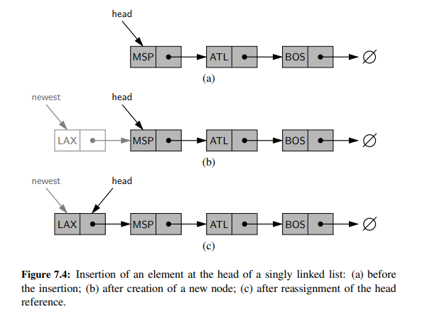
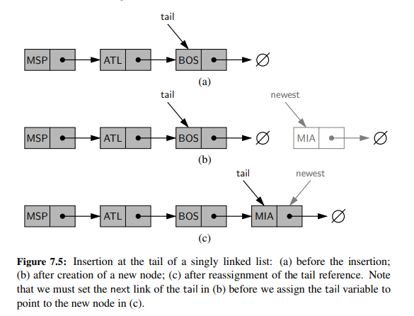

# Chapter 7 Linked Lists

Linked lists provides an alternative to an *array-based* sequence (such as a Python list). Both
array-based sequences and linked lists keep elements in a certain order, but using a very different style. 
An array provides the more centralized representation, with one large chunk of memory capable of accommodating references to many
elements. A linked list, in contrast, relies on a more distributed representation in
which a lightweight object, known as a node, is allocated for each element. Each
node maintains a reference to its element and one or more references to neighboring
nodes in order to collectively represent the linear order of the sequence.

Python’s list class is highly optimized, and often a
great choice for storage. With that said, there are some notable disadvantages:

- The length of a dynamic array may be longer than the actual number of elements that it stores. 
- Amortized bounds are not always acceptable. For example, if you are writing a real-time application that requires a 
guarantee on the running time of an operation, then you cannot afford to have the occasional slow operation.
- Insertions and deletions at interior positions of an array are expensive, because they may require shifting all 
of the elements that follow the position of the insertion or deletion.

## Singly Linked Lists

A singly linked list is a concrete data structure consisting of a sequence of nodes. Each node stores element and 
a reference to the next node (or None if it is the last node).

Adding elements to a singly linked list can be done in two ways:

- **Add to the head**: Create a new node, set its element to the new element, set its next link to refer to the current head,
and then set the list’s head to point to the new node.

- **Add to the tail**: Create a new node, set its element to the new element, set its next link to None, and then set the
next link of the tail node to point to the new node. Finally, update the tail reference itself to the new node.

## Doubly linked list

A doubly linked list is a concrete data structure consisting of a sequence of nodes. Each node stores element and
a reference to the next node (or None if it is the last node) and a reference to the previous node (or None if it is the
first node).
We can use the concept of sentinels to simplify the implementation of doubly linked lists. A sentinel is a dummy node
that does not store an element, and is permanently inserted at the head and tail of the list. The benefit of using sentinels
is that we can eliminate the need to check for empty lists when performing insertions and deletions.

