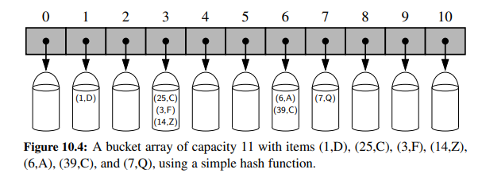
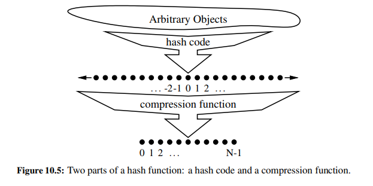
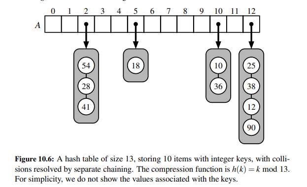
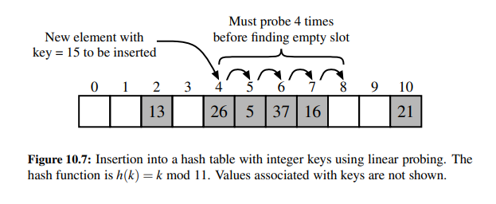
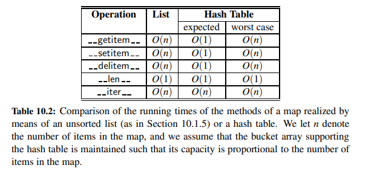
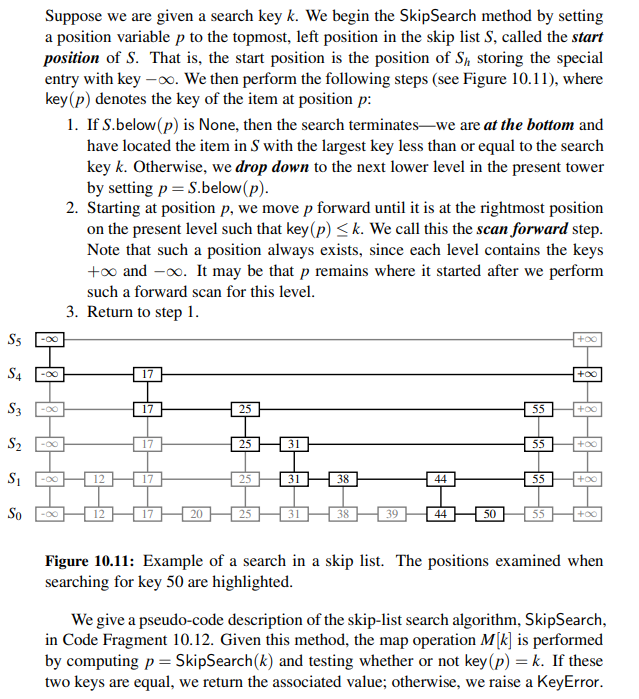
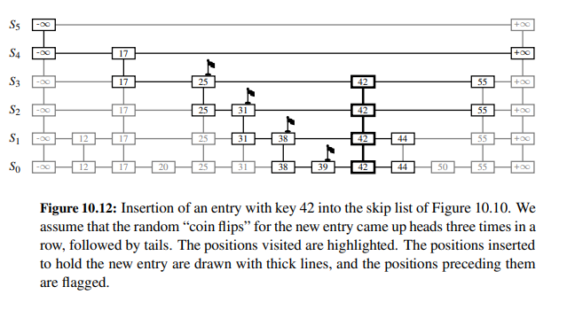
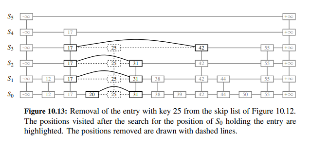

# Chapter 10: Maps, Hash Tables, Skip Lists

## Maps and Dictionaries

- A map is a collection of key-value pairs that provides fast insertion, deletion, and lookup of the value associated
  with a given key.
- A dictionary is a map where the keys and values can be arbitrary objects. Dictionaries are commony known as
  associative arrays or maps.

### The Map ADT

The map ADT supports the following behaviors:

- `M[k]`: Return the value associated with key `k`, if one exists; otherwise raise a KeyError.
  In python this is implemented with the `__getitem__` special method.
- `M[k] = v`: Associate value `v` with key `k`, replacing the existing value if the map already contains an item with
  key `k`.
  In python this is implemented with the `__setitem__` special method.
- `del M[k]`: Remove the item associated with key `k` from the map, if it exists; otherwise raise a KeyError.
  In python this is implemented with the `__delitem__` special method.
- `len(M)`: Return the number of items in map `M`.
  In python this is implemented with the `__len__` special method.
- `iter(M)`: Return an iteration of all keys in `M`.
  In python this is implemented with the `__iter__` special method and it allows us to use the `for` loop.

In addition to the behaviors listed above, the map ADT also supports the following behaviors:

- `k in M`: Return `True` if key `k` is in map `M`, `False` otherwise.
  In python this is implemented with the `__contains__` special method.
- `M.get(k, d=None)`: Return the value associated with key `k`, if one exists; otherwise return the default value `d`.
  This provides a way to avoid raising a `KeyError` when accessing a key that is not in the map.
- `M.setdefault(k, d=None)`: If key `k` is in map `M`, return its associated value. If not, insert key `k` with
  value `d` and return `d`.
- `M.pop(k, d=None)`: If key `k` is in map `M`, remove the item associated with it and return its value. If not, return
  the default value `d`.
  If `d` is not provided and `k` is not in the map, raise a `KeyError`.
- `M.popitem()`: Remove and return an arbitrary `(k, v)` item pair from map `M`. If the map is empty, raise
  a `KeyError`.
- `M.clear()`: Remove all items from map `M`.
- `M.keys()`: Return a set-like view of all keys in map `M`.
- `M.values()`: Return a set-like view of all values in map `M`.
- `M.items()`: Return a set-like view of all `(k, v)` item pairs in map `M`.
- `M.update(M2)`: Insert all items from map `M2` into map `M`, replacing the value of any existing key.
- `M == M2`: Return `True` if maps `M` and `M2` have the same key-value pairs, `False` otherwise.
- `M != M2`: Return `True` if maps `M` and `M2` do not have the same key-value pairs, `False` otherwise.

### Python's MutableMapping Abstract Base Class

Methods that are declared to be abstract in a base class must be implemented by concrete subclasses. However,
an abstract base class may provide concrete implementation of other methods that depend upon use of the presumed
abstract methods.
Python's `collections` module provides two abstract base classes for maps: `MutableMapping` and `Mapping`.
The `Mapping` class includes methods that do not modify the map, while the `MutableMapping` class extends `Mapping` and
adds methods that modify the map.

There's five core methods that must be implemented by concrete subclasses
of `MutableMapping`: `__getitem__`, `__setitem__`, `__delitem__`, `__len__`, and `__iter__`.

### Custom MapBase implementation

We define a MapBase class that extends the `MutableMapping` abstract base class so that we inherit all of the behaviors
of the map ADT.

## Hash Tables

The most common implementation of a map is a hash table, which is a data structure that supports fast insertion,
deletion, and lookup on average.

There are two challenges in extending this framework to the more general setting of a map. First, we may not wish to
devote an array of length N if it is the case that $n << N$. Second, we do not in general require that a map's keys be
integers.
The novel concept that allows us to address both of these challenges is the use of a `hash function` to map general keys
to corresponding indices in a table.

Ideally, keys will be well distributed in the range from $0$ to $N-1$ by a hash function, but in practice there may be
two or more keys that map to the same index. As a result, we will conceptualize our table as a `bucket array`, in which
each bucket
may manage a collection of items that are sent to a specific index by hash function.



### Hash Functions

THe goal of a **`hash function`**, $h$, is to map each key $k$ to an integer in the range $0$ to $N-1$, where $N$ is
the capacity of the bucket array for a hash table.

THe main idea is to use the hash function value, $h(k)$, as an index into the bucket array, $A$, instead of the key $k$
itself (which may not be appropriate for the array indexing operator).
That is, we store the item $(k, v)$ in bucket $A[h(k)]$.

If there are two or more keys that map to the same index (meaning that $h(k_1) = h(k_2)$), then two different items
will be stored in the same bucket. In this case, we say that a `collision` has occurred.

**The best strategy for handling collisions is to try to avoid them in the first place.**
We say that a hash function is `good` if it maps the keys in our map so as to sufficiently minimize the number of
collisions.
In practice, we can never completely avoid collisions, but we can try to minimize their frequency.

For practical reasons we would like a hash function to be `fast` and `easy` to compute.

It is common to view the evaluation of a hash function as a two-step process. First, we compute a hash code, $h$, for
the key $k$.
Second, we compute the index, $i$, from the hash code, $h$, by using the formula $i = h \mod N$, where $N$ is the
capacity of the bucket array.



#### Hash Codes

The first action that a hash function performs is to take an arbitrary key `k` in our map and compute an integer that
is called the `hash code` for `k`; this integer need not be in the range $\left[0, N-1\right]$ and may even be negative.

We desire that the set of hash codes assigned to our keys should avoid collisions as much as possible. For if the hash
codes
of our keys cause collisions, then there is no hope for our compression function to avoid them.

##### Treating the Bit Representation as an Integer

To begin, we note that, for any data type `X` that is represented using at most as many
bits as our integer hash codes, we can simply take as a hash code for `X` an integer
interpretation of its bits. For example, the hash code for key `314` could simply be
`314`. The hash code for a floating-point number such as `3.14` could be based upon
an interpretation of the bits of the floating-point representation as an integer.

For a type whose bit representation is longer than a desired hash code, the above
scheme is not immediately applicable. For example, Python relies on `32-bit` hash
codes. If a floating-point number uses a 64-bit representation, its bits cannot be
viewed directly as a hash code. One possibility is to use only the `high-order` 32 bits
(or the `low-order` 32 bits). This hash code, of course, ignores half of the information
present in the original key, and if many of the keys in our map only differ in these
bits, then they will collide using this simple hash code.

A better approach is to combine in some way the high-order and low-order portions of a 64-bit key to form a 32-bit
hash code, which takes all the original bits into consideration. A simple implementation is to add the two components
as 32-bit numbers (ignoring overflow), or to take the exclusive-or of the two components.
These approaches of combining components can be extended to any object `x` whose binary representation can be
viewed as an `n-tuple` `(x[0], x[1], ..., x[n-1])` of 32-bit integers, for example, by forming a has code
for `x` as $sum_{i=0}^{n-1}x_i$ or $x_0 \oplus x_1 \oplus ... \oplus x_{n-1}$ (where $\oplus$ denotes the exclusive-or
operation
which is implemented in Python with the `^` operator).

##### Polynomial Hash Codes

The summation and exclusive-or hash codes are not good choices for character strings or other variable-length objects
that can be viewed as tuples of the form $(x_0, x_1, ..., x_{n-1})$ where the order of the $x_i$'s matters.
For example, consider a 16-bit hash code for a character string `s` that sums the Unicode values of the characters
in `s`.
This hash code unfortunately produces lots of unwanted collisions for common groups of strings.
For example, the strings `ab` and `ba` have the same hash code, as do the strings `aab` and `bba` or `temp10`
and `mep01t`.

A better hash code should somehow take into account the order of the characters in the string.
An alternative hash code, which does exactly this, is to choose a nonzero constant, $a\\neq1$, and use as a hash code
the value

$$ h(s) = \sum_{i=0}^{n-1}a^{n-1-i}x_i $$

Mathematically speaking, this is simply a polynomial in $a$ with coefficients $x_0, x_1, ..., x_{n-1}$ of an object `x`.
This hash code is
therefore called a `polynomial hash code`. By Horner's rule, this polynomial can computed as

$$ h(s) = x_{n-1} + a(x_{n-2} + a(x_{n-3} + ... + a(x_2 + a(x_1 + ax_0))...)) $$

Intuitively, a polynomial hash code uses multiplication by different powers as a
way to spread out the influence of each component across the resulting hash code.

Of course, on a typical computer, evaluating a polynomial will be done using
the finite bit representation for a hash code; hence, the value will periodically overflow the bits used for an integer.
Since we are interested in a good spread of the object x with respect to with respect to other keys, we simply ignore
such overflows.
Still we should be mindful that such overflows are occurring and choose the constant $a$ so that it has some
nonzero, low-order bits, which will serve to preserve some of the information content even as we are in an overflow
situation.

When choosing a constant for hashing, particularly in the context of polynomial hash codes, the properties of the
constant can significantly affect the effectiveness and distribution of the hash function. The concept of "non-zero low
order bits" plays a crucial role in this selection. Let's explore an example and understand the rationale behind it:

**Example of a Constant for Hashing:**

Suppose we're implementing a polynomial hash code where the hash function is defined as:

\[ h(s) = \sum_{i=0}^{n-1}a^{n-1-i}x_i \]

Here, \( a \) is a constant, and \( x_i \) are the values derived from the characters in the string.

A commonly chosen value for \( a \) in such hash functions is a prime number that is not too close to a power of 2. For
example, you might choose \( a = 31 \) or \( a = 37 \).

> Why Choose Such Constants?

1. **Prime Number**:
    - Prime numbers are often chosen because they help in achieving a more uniform distribution of hash values. Primes
      are not multiples of smaller numbers, which reduces the risk of pattern formation and collisions in hash code
      distribution.

2. **Non-Zero Low Order Bits**:
    - A prime number like 31 or 37, when represented in binary, has non-zero low order bits.
    - For instance, 31 in binary is `11111`, and 37 is `100101`. Notice the non-zero bits at the lower end.
    - This characteristic ensures that even small changes in the input (like a single character) can significantly alter
      the hash value, enhancing the hash function's sensitivity to input changes.

3. **Not Close to a Power of 2**:
    - Constants that are close to a power of 2 (like 32, which is \( 2^5 \)) can lead to patterns in the hash values,
      especially in binary systems where computation is based on powers of 2.
    - By choosing a prime that is not near a power of 2, such as 31 or 37, you avoid these patterns and ensure more
      randomness and uniformity in the distribution of hash values.

##### Cyclical Shift Hash Codes

A variant of the polynomial hash code replaces multiplication by a constant with a `cyclic shift` of a partial sum by a
certain number of bits.
For example, a 5-bit cyclic shift of a 32-bit value `00111101100101101010100010101000` is achieved by taking the
leftmost
five bits and placing those on the right, resulting in `10110010110101010001010100000111`.

While this operation has little natural meaning in terms of arithmetic, it accomplishes the goal of varying the bits of
the calculation. In Python, the cyclic shift operation is implemented with the `<<` and `>>` operators, taking care to
truncate
the results to 32-bit integers.

**Python hash function:**

The standard method for computing hash codes in Python is to use the `hash()` function, which is a built-in function.
However, only immutable types can be hashed in Python. This restriction is meant to ensure that a particular object’s
hash code remains constant during that object’s lifespan.

Notes: When hashing a frozenset, the order of elements is not taken into account. Therefore, frozenset({1, 2}) and
frozenset({2, 1}) will have the same hash value. So it is natural to compute exclusive-or of the hash codes of the
elements
of the frozenset without any shift.

```python
frozenset1 = frozenset([1, 2, 3])
frozenset2 = frozenset([3, 2, 1])

hash1 = 0
for element in frozenset1:
    hash1 = hash1 ^ hash(element)  # xor operation of hash codes

hash2 = 0
for element in frozenset2:
    hash2 = hash2 ^ hash(element)  # xor operation of hash codes

print(hash1, hash2)

# Output: 0 0 (same hash code)
```

#### Compression Functions

The hash code for a key k will typically not be suitable for immediate use with a bucket array, because the integer hash
code may be negative or may exceed the capacity of the bucket array. Thus, once we have determined an integer hash code
for a key object k, there is still the issue of mapping that integer into the range $\left[0, N-1\right]$.

This computation, known as a `compression function`, is the second action performed as part of an overall hash function.
A good compression function is one that minimizes the number of collisions for a given set of distinct hash codes.

##### The division method

A simple compression function is the division method, which maps an integer `i` to $i \mod N$.

where $N$, the capacity of the bucket array, is a fixed positive integer. Additionally, if we take $N$ to be a prime
number,
then this compression function helps "spread out" the hash codes of the keys across the range $\left[0, N-1\right]$.
Indeed, if $N$ is not prime, then there is greater risk that patterns in the distribution of hash codes will be repeated
in the distributions of hash values, thereby causing more collisions.

Choosing a prime number for $N$ is a good idea, but it is not sufficient to ensure a good compression function. For
example,
if there is a repeated pattern of hash codes of the form $pN + q$ for several different p's, then there will still be
collisions.

##### The MAD method

A better approach is to use a `multiplication-addition-and-division` method, which is known as the `MAD method`.
This method uses the formula

$$ h(k) = ((ak + b) \mod p) \mod N $$

where $a$ and $b$ are positive integers from $[0,p-1]$, $p$ is a prime number larger than $N$.

This compression function is chosen in order to eliminate the possibility of patterns in the hash codes affecting the
distribution of hash values. The prime number $p$ is chosen to be larger than $N$ in order to ensure that the
distribution of hash values is spread out as much as possible.

The choice of $a$ and $b$ is crucial to the effectiveness of the MAD method. In particular, $a$ should not be $0$.

### Collision-handling Schemes

The main idea of a hash table is to take a bucket array, A, and a hash function, h, and use them to implement a map by
storing each item $(k, v)$ in the bucket $A[h(k)]$. This simple idea is challenged, however, when we have two distinct
keys, $k_1$ and $k_2$, such that $h(k_1) = h(k_2)$. The existence of such collisions prevents us from simply
inserting a new item $(k, v)$ directly into the bucket $A[h(k)]$. It also complicates our procedure for performing
insertion,
deletion, and lookup.

#### Separate Chaining

The simplest way to handle collisions is to allow each bucket to store a collection of items. This approach is called
`separate chaining`, because the items in the map are chained together in linked lists.



In the worst case, all of the items are stored in the same bucket, and the hash table degenerates to a linked list.
However, if the hash function is good, then the number of collisions should be small, and the linked lists should be
short.
Thus, the expected time for insertion, deletion, or lookup is $O(1)$.

#### Open Addressing

An alternative to separate chaining is to store each item directly within the bucket array, in a location computed
directly from its hash code. This approach is called `open addressing`, because it does not rely on chaining to handle
collisions.

#### Linear Probing and Its Variants

The simplest open addressing scheme is called `linear probing`. In this scheme, we probe sequentially through the
buckets until we find an empty bucket, or until we have checked all buckets. The probe sequence is given by the formula

$$ h(k, i) = A[(j+i) \mod N] $$

where $N$ is the capacity of the bucket array, $j$ is the hash code of the key $k$ ($j = h(k)$), and $i$ is the probe
number.



The main advantage of linear probing is that it tends to cluster items with nearby hash codes together in the bucket
array. This clustering can be beneficial, because it allows us to take advantage of the principle of `temporal
locality` in our programs. That is, if we have recently accessed an item, then it is likely that we will access it again
soon. Although use of an open addressing scheme can save space, linear probing suffers from an additional disadvantage.
It tends to cluster the items of a map into contiguous runs, which may even overlap (particularly if more than half of
the cells in the hash table are occupied). This clustering can lead to `primary clustering`, which is a phenomenon that
can slow down search operations considerably.

A variant of linear probing is called `quadratic probing`. In this scheme, the probe sequence is given by the formula

$$ h(k, i) = A[(j + f(i)) \mod N] $$
where $f(i) = i^2$.

As with linear probing, the quadratic robing strategy complicates the removal operation. If we remove an item from the
middle of a cluster, then we will break the cluster into two pieces. This will cause us to miss items that are stored
in the second piece of the cluster. But it does avoid the kind of primary clustering that can occur with linear probing.

Nevertheless, it creates its own kind of clustering, called `secondary clustering`, where the set of filled array cells
still has a non-uniform pattern, even if we assume that the original hash codes are distributed uniformly.

A third variant of linear probing is called `double hashing`. In this scheme, the probe sequence is given by the formula

$$ h(k, i) = A[(j + i \cdot r(k)) \mod N] $$

where $r(k)$ is a second hash function, called the `rehash function`. The rehash function should be designed so that it
never evaluates to $0$ for any key $k$.

A common choice for the rehash function is $r(k) = q - (k \mod q)$, where $q$ is a prime number less than $N$.

Another approach to avoid clustering with open addressing is to use a `random probe sequence`. In this scheme, the probe
sequence is given by the formula

$$ h(k, i) = A[(j + f(i)) \mod N] $$

where $f(i)$ is based on a pseudo-random number generator, providing a repeatable, but somewhat arbitrary, sequence of
subsequent probes that depend upon the bits of the original hash code.
This is what is currently used in Python dictionaries.

### Load Factors, Rehashing, and Efficiency

The `load factor` of a hash table is defined to be the ratio of the number of items in the table to the capacity of the
bucket array. That is, if $n$ is the number of items in the table and $N$ is the capacity of the bucket array, then the
load factor is $n/N$.

The load factor is a measure of how full the hash table is. If the load factor is close to $1$, then the hash table is
nearly full, and its efficiency will suffer because of the increased likelihood of collisions.

The `rehashing` operation is used to increase the capacity of the bucket array when the load factor exceeds a certain
threshold. The rehashing operation is performed by creating a new bucket array, $A'$, whose capacity is a prime number
that is roughly twice the capacity of the old bucket array, $A$. Then, each item in the old bucket array is inserted
into the new bucket array, using the hash function for the new bucket array.

In Python dictionaries, the load factor is kept below $2/3$ by default. When the load factor exceeds $2/3$, the capacity
of the bucket array is increased to roughly twice its previous value, and the items are rehashed into the new bucket
array.

> Comparison of the running times of the methods of a map realized by means of an unsorted list or a hash table.



## Sorted Maps

A `sorted map` is a map in which the entries are maintained in sorted order by key. That is, the keys are ordered using
a total order relation, and the entries are stored in a data structure that supports efficient insertion, deletion, and
lookup of the entry with minimum key, maximum key, or an arbitrary key.

A sorted map includes all the behaviors of a map, but it also supports the following additional behaviors:

- `M.find_min()`: Return the (key, value) pair with minimum key, or None if the map is empty.
- `M.find_max()`: Return the (key, value) pair with maximum key, or None if the map is empty.
- `M.find_lt(k)`: Return the (key, value) pair with the greatest key less than k, or None if there is no such key.
- `M.find_le(k)`: Return the (key, value) pair with the greatest key less than or equal to k, or None if there is no
  such key.
- `M.find_gt(k)`: Return the (key, value) pair with the least key greater than k, or None if there is no such key.
- `M.find_ge(k)`: Return the (key, value) pair with the least key greater than or equal to k, or None if there is no
  such key.
- `M.find_range(start, stop)`: Iterate all (key, value) pairs such that start <= key < stop. If start is None, iteration
  begins with the minimum key of the map. If stop is None, iteration continues through the maximum key of the map.
- `iter(M)`: Iterate all keys of the map according to their natural order, from smallest to largest.
- `reversed(M)`: Iterate all keys of the map in reverse order; that is, from largest to smallest. (`__reversed__` is a
  special method that allows us to use the reversed function.)

### Sorted Search Tables

A `sorted search table` is a sorted map in which the underlying data structure is a `list` or `array` so that the keys
are stored in order.

The primary advantage of this representation, and our reason for insisting that A be array-based, is that it allows us
to use the **binary search** algorithm for a variety of operations.

We can add some modifications to the binary search to provide far more useful information when performing forms of
inexact search.
When performing a binary search, we can determine the index at or near where a target might be found.
During an unsuccessful search, although the target is not found, the algorithm wil effectively determine a pair of
indices
designating elements of the collection that are just less than or just greater than the missing target.

### Analysis

- Table of performance of the methods of a sorted map realized by means of a sorted search table.

| Operation                                                      | Running Time                                           |
|----------------------------------------------------------------|--------------------------------------------------------|
| `len(M)`                                                       | $O(1)$                                                 |
| `k in M`                                                       | $O(\log n)$                                            |
| `M[k]=v`                                                       | $O(\log n)$ if existing k, $O(n)$ worst case           |
| `del M[k]`                                                     | $O(n)$ worst case                                      |
| `M.find_min()`, `M.find_max()`                                 | $O(1)$                                                 |
| `M.find_lt(k)`, `M.find_gt(k)`, `M.find_le(k)`, `M.find_ge(k)` | $O(\log n)$                                            |
| `M.find_range(start, stop)`                                    | $O(s + \log n)$, $s$ is the number of entries returned |
| `iter(M)`,   `reversed(M)`                                     | $O(n)$                                                 |

## Skip Lists

A `skip list` S for a map M consists of a series of lists {$S_0, S_1, ..., S_h$}.
Each list $S_i$ stores a subset of the items of M sorted by increasing keys, plus items with two sentinel keys, denoted
$-\infty$ and $+\infty$, where $-\infty$ is the smallest possible key and $+\infty$ is the largest possible key.
In addition, the lists in S satisfy the following properties:

- List $S_0$ contains all the items of M (plus the two sentinel keys).
- For $i=1,..h-1$, list $S_i$ contains (in addition to the two sentinel keys) a randomly generated subset of the items
  in list $S_{i-1}$, with the property that any item in $S_{i-1}$ is also in $S_i$.
- List $S_h$ contains only the two sentinel keys.


Functions that generate numbers that can be viewed as random numbers are built into most modern computers, because they
are used extensively in computer games, cryptography, and computer simulations, Some functions, called pseudo-random
number generators, generate random-like numbers, starting with an initial seed. Other methods use hardware devices to
extract “true” random numbers from nature.

The main advantage of using randomization in data structure and algorithm design is that the structures and functions
that result are usually simple and efficient.
The skip list has the same logarithmic time bounds for searching as is achieved by the binary search algorithm, yet it
extends that performance to update methods when inserting or removing items.

A skip list makes random choices in arranging its structure in such a way that search and update times are $O(\log n)$
**on average**.
Interestingly, the notion of average time complexity used here does not depend on the probability distribution of the
keys
in the input. Instead, it depends on the use of a random-number generator in the implementation of the insertions to
help decide
where to place the new item.
The running time is averaged over all possible outcomes of the random numbers used when inserting entries.

Using the position abstraction used for lists and trees, we view a skip list as a two-dimensional collection of
positions
arranged horizontally into levels and vertically into towers.
Each level is a list $S_i$ and each tower contains positions storing the same item across consecutive lists (levels).
The position in a skip list can be traversed using the following methods:

- `next(p)`: Return the position following p on the same level.
- `prev(p)`: Return the position preceding p on the same level.
- `above(p)`: Return the position above p in the tower.
- `below(p)`: Return the position below p in the tower.

We can easily implement a skip list by means of a linked structure such that the individual traversal methods each take
$O(1)$ time, given a skip-list position p.
Such a linked structure is essentially a collection of h doubly linked lists aligned at towers, which are also doubly
linked lists

### Search and Update Operations

The skip-list search and update algorithms are based on an elegant SkipSearch method that takes a key k and finds the
position p of the item in list $S_0$ with the largest key that is less than or equal to k.

**Pseudocode for SkipSearch:**

```text
Algorithm SkipSearch(k):
    input: A search key k
    output: Position p in the bottom list S0 with the largest key such that key(p) ≤ k
    
    p ← start    {begin at start position: top left corner of the skip list}
    while below(p) ≠ null do
        p ← below(p)    {go down one level}
        while key(next(p)) ≤ k do
            p ← next(p)    {go right one position}
    
    return p
```



#### Insertion

The execution of the map operation M[k] = v begins with a call to SkipSearch(k), which returns the position p of the
item with the largest key that is less than or equal to k (p may hold the sentinel key $-\infty$ if no such item
exists).
If key(p) = k, then the item with key k is already in the map, and we simply replace its value with v.
Otherwise, we insert a new item with key k and value v just after position p in list $S_0$.
The new item is then inserted into the other lists of the skip list by means of a random process.
At each level $i$, we flip a coin to determine whether the new item should be inserted into list $S_i$.

**Pseudocode for SkipInsert:**

```text
Algorithm SkipInsert(k, v):
    input: A search key k and an associated value v
    output: A new entry with key equal to k and value equal to v is added to the skip list
    
    p ← SkipSearch(k)    {find the position of the item with the largest key ≤ k}
    q ← None
    i ← -1
    repeat
        i ← i + 1
        if i ≥ h then
            h ← h + 1       {add a new empty top level to the skip list}
            t ← next(s)
            s ← insertAfterAbove(None, s, (−∞, None))    {add two new sentinel keys}
            insertAfterAbove(s, t, (+∞, None))
        while above(p) is None do
            p ← prev(p)    {go to the left until we find a position with an above link}
        p ← above(p)    {go up one level}
        q ← insertAfterAbove(p, q, (k, v))    {insert (k, v) into the lowest list}
    until coinFlip() = tails    {stop when a coin flip comes up tails}
    n ← n + 1    {one more entry in the skip list}
    return q
```



#### Removal

The removal algorithm is quite simple. We begin by executing SkipSearch(k) to find the position p of the item with key
k.
If the position p stores an entry with key different from k, we raise a KeyError. Otherwise, we remove p and all the
positions above p, which are easily accessed by using above operations to climb up the tower of this entry in S starting
at position p. While removing levels of the
tower, we reestablish links between the horizontal neighbors of each removed position.



### Maintain the Topmost Level

A skip list S must maintain a reference to the start position (the topmost, left position in S) as an instance variable,
and must have a policy for any insertion that wishes to continue inserting a new entry past the top level of S.

We can either restrict the height of S to a fixed value (a function of n), for example $h = 3\log n$, or we can allow insertion
of new position as long as heads keep getting returned from the random number generator.


- Table of performance of the methods of a sorted map realized by means of a skip list.

| Operation                                                      | Running Time                                                    |
|----------------------------------------------------------------|-----------------------------------------------------------------|
| `len(M)`                                                       | $O(1)$                                                          |
| `k in M`                                                       | $O(\log n)$ expected                                            |
| `M[k]=v`                                                       | $O(\log n)$ expected                                            |
| `del M[k]`                                                     | $O(\log n)$ expected                                            |
| `M.find_min()`, `M.find_max()`                                 | $O(1)$                                                          |
| `M.find_lt(k)`, `M.find_gt(k)`, `M.find_le(k)`, `M.find_ge(k)` | $O(\log n)$ expected                                            |
| `M.find_range(start, stop)`                                    | $O(s + \log n)$ expected, $s$ is the number of entries returned |
| `iter(M)`,   `reversed(M)`                                     | $O(n)$                                                          |


## Sets, Multisets, and Multimaps

- `Set`: A set is a collection of distinct elements.
- `Multiset`: A multiset is a collection of elements that allows for multiple instances of the same element.
- `Multimap`: A multimap is a collection of elements that allows for multiple instances of the same key.