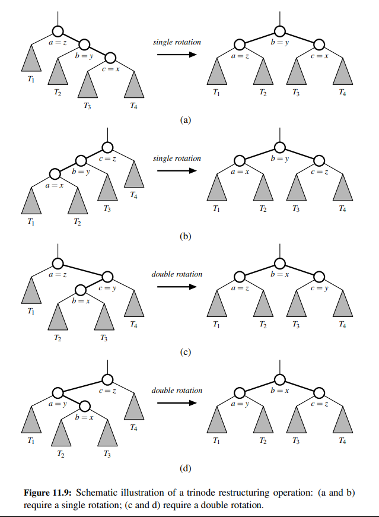

# Chapter 11. Search Trees

## Binary Search Trees

We can efficiently implement sorted map using a search tree structure.

Binary trees are an excellent data structure for storing items of a map, assuming we have an order relation defined
on the keys.
A binary search tree is a binary tree T with each position p storing a key-value pair (k, v) such that:

- Keys stored in the left subtree of p are less than k.
- Keys stored in the right subtree of p are greater than k.


### Navigating a BST

**An inorder traversal of a BST visits positions in the increasing order of their keys.**

An inorder traversal is typically expressed using a *top-down* recursion.

With a BST, we can provide additional navigation based on natural order of the keys stored in the tree.
In particular, we can support the following methods, akin to those provided by a PositionalList:

- `first()`: Return the position containing the least key (or None, if the tree is empty).
- `last()`: Return the position containing the greatest key (or None, if the tree is empty).
- `before(p)`: Return the position containing the greatest key that is less than that of position p (i.e. the position
  that would be visited immediately before p in an inorder traversal), or None if p is the first position.
- `after(p)`: Return the position containing the least key that is greater than that of position p (i.e. the position
  that would be visited immediately after p in an inorder traversal), or None if p is the last position.

The `first()` and `last()` methods are trivial to implement, as they simply follow the left or right child pointers
from the root until reaching an external node.
The successor of a position, `after(p)`, is determined by the following algorithm:

```text
Algorithm after(p):
    if right(p) is not None:    {successor is leftmost position in p’s right subtree}
        walk =  right(p)
        while left(walk) is not None do
            walk = left(walk)
        return walk
    else:   {successor is nearest ancestor having p in its left subtree}
        walk = p
        ancestor = parent(walk)
        while ancestor is not None and walk == right(ancestor) do
            walk = ancestor
            ancestor = parent(walk)
        return ancestor
```

### Searches

The most important consequence of the structural property of a BST is its namesake: the ability to efficiently search
for an entry with a given key.
We can attempt to locate a particular key in a BST by viewing it as a decision tree. In this case the question asked at
each position is: "Is the search key less than, equal to, or greater than the key stored at the position?"

- Pseudocode for the search algorithm:

```text
Algorithm TreeSearch(T, p, k):
    if k == p.key() then
        return p
    else if k < p.key() then
        if left(p) is not None then
            return TreeSearch(T, left(p), k)
    else
        if right(p) is not None then
            return TreeSearch(T, right(p), k)
    return p
```

- The worst-case running time of the search algorithm is O(h), where h is the height of the tree.


### Insertions and Deletions

**Insertion**

The map command `M[k] = v` begins by calling `T.search(k)` to determine whether the key k is already in the tree.
If so, the value associated with k is replaced by v. Otherwise, the new entry is inserted into the tree as a leaf.

- Pseudocode for the insertion algorithm:

```text
Algorithm TreeInsert(T, k, v):
    p = TreeSearch(T, root(T), k)
    if k == p.key() then
        set p's value to v
    else if k < p.key() then
        add node storing (k, v) as left child of p
    else
        add node storing (k, v) as right child of p
```

**Deletion**

The map command `del M[k]` begins by calling `T.search(k)` to determine whether the key k is already in the tree.
If so, we distinguish between two cases:

- If p has at most one child, we remove p by splicing out its position.
- If position p has two children, we cannot simply remove the node from T since this would create a “hole” and two
  orphaned children. Instead, we proceed as follows:
>> 1. We locate position r=above(p) that follows p in an inorder traversal of T.
>> 2. We use r's item as a replacement for the item at p (that is to be deleted).
>> 3. Having used r's as a replacement for p, we instead delete the node at position r, which is guaranteed to have at
  most one child.


## Balanced Search Trees

The primary drawback of a BST is that its performance degrades to O(n) when the tree becomes unbalanced.
A balanced search tree is a search tree that maintains O(log n) height.

The primary operation to rebalance a binary tree is called a *rotation*.
A rotation is a local operation that preserves the BST property. During a rotation, we rotate a child to be above its parent.

- Pseudocode for a rotation:

```text
Algorithm restructuring(x):
    input: a Position x of a BST that has both a parent y and a grandparent z
    output: Tree T after a trinode restructuring (which corresponds to a single or double rotation) involving positions x, y, and z
    
    1. Let (a, b, c) be a left-to-right (inorder) listing of the positions x, y, and z, and let ($T_1$, $T_2$, $T_3$, $T_4$) 
    be a left-to-right (inorder) listing of the subtrees of x, y, and z not rooted at x, y, or z.
    2. Replace the subtree rooted at z with a new subtree rooted at b.
    3. let a be the left child of b and let $T_1$ and $T_2$ be its left and right subtrees, respectively.
    4. let c be the right child of b and let $T_3$ and $T_4$ be its left and right subtrees, respectively.
    
```



## AVL Trees

An AVL tree is a binary search tree that maintains O(log n) height by making use of an auxiliary balance factor attribute
on each node.

- The balance factor of a node v is defined as the difference between the height of v's left subtree and the height of
  v's right subtree.
- A node v is said to be balanced if the balance factor of v is -1, 0, or 1.

