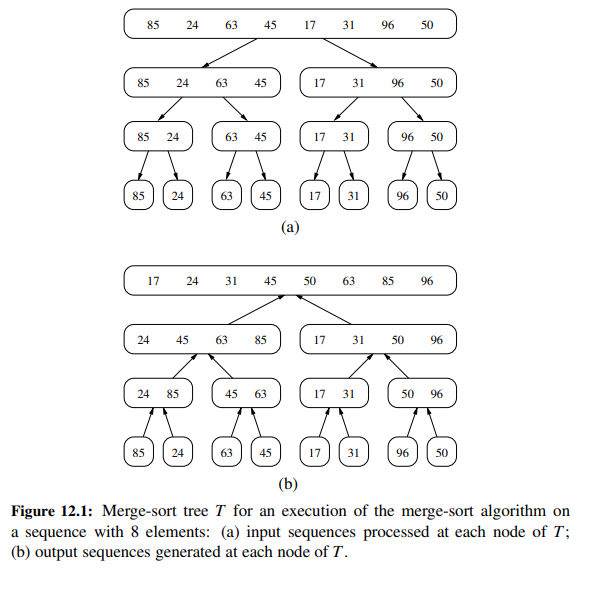
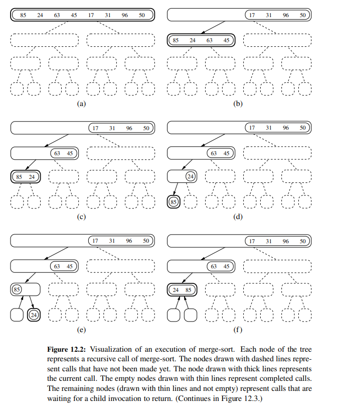
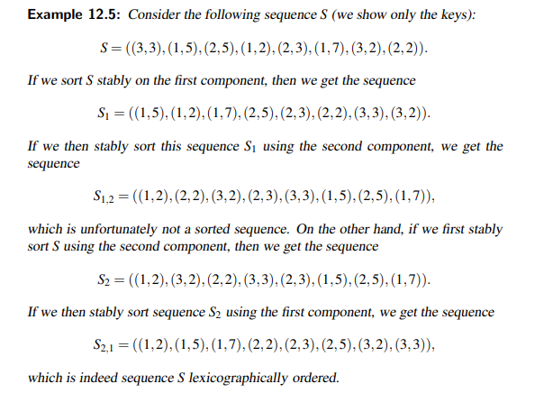

# Chapter 12 Sorting and Selection

Sorting is the process of rearranging a sequence of objects so as to put them in some logical order. 
For example, English words can be alphabetically ordered, or integers can be ordered from smallest to largest value. 
Sorting is a classic problem that has been studied extensively in computer science. 
It is a fundamental problem that has many applications, including:
- **Data compression**: Sorting a sequence can often make it easier to compress.
- **Optimal search algorithms**: Sorting is often a useful preprocessing step in algorithms that solve various search problems.
- **Computing set intersections**: If two sequences are sorted, then we can find their intersection using a simple linear-time algorithm.


This chapter presents several sorting algorithms, including:
- **merge sort**
- **quick sort**
- **bucket sort**
- **radix sort**

## Divide and Conquer

The divide-and-conquer paradigm involves three steps at each level of the recursion:
- **Divide** the problem into a number of subproblems that are smaller instances of the same problem.
- **Conquer** the subproblems by solving them recursively. If the subproblem sizes are small enough, however, 
just solve the subproblems in a straightforward manner.
- **Combine** the solutions to the subproblems into the solution for the original problem.


### Merge Sort

Merge sort is a recursive algorithm that continually splits a list in half. It's a **divide and conquer** algorithm.
To sort a sequence S with n elements using the three divide-and-conquer steps, the merge-sort algorith proceeds as follows:

- **Divide**: If S has zero or one element, return S immediately; it is already sorted. Otherwise, (S has at least two elements),
remove all the elements from S and put them into two sequences, S1 and S2, each containing about half of the elements of S; 
S1 contains the first $\lfloor n/2 \rfloor$ elements of S, and S2 contains the remaining $\lceil n/2 \rceil$ elements.
- **Conquer**: Recursively sort sequences S1 and S2.
- **Combine**: Put back the elements into S by merging the sorted sequences S1 and S2 into a sorted sequence.



- Pseudocode
```text
Algorithm merge(S1, S2, S):
    Input: Two sorted sequences S1 and S2, and an empty sequence S
    Output: The sorted sequence S with all the elements of S1 and S2

    while S1 and S2 are not empty do
        if S1.first() < S2.first() then
            S.add(S1.remove(S1.first()))
        else
            S.add(S2.remove(S2.first()))
    while S1 is not empty do
        S.add(S1.remove(S1.first()))
    while S2 is not empty do
        S.add(S2.remove(S2.first()))
 
Algorithm merge_sort(S):
    Input: A sequence S with n elements
    Output: A sorted sequence S

    if n < 2 then
        return
    else
        let S1 and S2 be two sequences containing the first n/2 and last n/2 elements of S, respectively
        merge_sort(S1)
        merge_sort(S2)
        merge(S1, S2, S)
```



**Note:** The merge-sort tree associated with an execution of merge-sort on a sequence
of size n has height $\lceil log n \rceil$.

A merge-sort algorithm sorts a sequence pf size n in $O(n log n)$ time, assuming two elements can be compared in $O(1)$ time.


### Quick Sort

Quick sort is a **divide and conquer** algorithm like merge-sort, but it uses this technique in a somewhat opposite way,
as all the hard work is done before the recursive calls.

The quick-sort algorithm sorts a sequence S using a simple recursive approach.
The main idea is to apply the divide-and-conquer technique, whereby we divide
S into subsequences, recur to sort each subsequence, and then combine the sorted
subsequences by a simple concatenation. In particular, the quick-sort algorithm
consists of the following three steps:

- **Divide**: If S has at least two elements (nothing needs to be done if S has zero or one element), select a specific
element x from S, which we call the **pivot**. As is common practice to choose the pivot $x$ to be the last element in $S$..
Remove all the elements from S and put them into three sequences: $L$, $E$, and $G$, such that:
    - $L$ contains the elements in S that are less than $x$.
    - $E$ contains the element in S that are equal to $x$.
    - $G$ contains the elements in S that are greater than $x$.
- **Conquer**: Recursively sort sequences $L$ and $G$.
- **Combine**: Put back the elements into S by concatenating $L$, $E$, and $G$ in order.


- Pseudocode for iterative quick-sort
```text
Algorithm quick_sort(S):
    Input: A sequence S with n elements
    Output: A sorted sequence S

    if n < 2 then
        return
    else
        let L, E, and G be sequences empty sequences
        let x be the last element in S
        while S is not empty do
            remove the first element from S and call it y
            if y < x then
                add y to the end of L
            else if y = x then
                add y to the end of E
            else
                add y to the end of G
        quick_sort(L)
        quick_sort(G)
        S = L + E + G
```

- Pseudocode for recursive quick-sort with partition
```text
Algorithm partition(S, a, b):
    Input: A sequence S with n elements, and indices a and b of S
    Output: A partition of S with respect to the pivot S[b]

    x = S[b]
    i = a - 1
    for j = a to b - 1 do
        if S[j] <= x then
            i = i + 1
            swap S[i] with S[j]
    swap S[i + 1] with S[b]
    return i + 1

Algorithm quick_sort(S, a, b):
    Input: A sequence S with n elements, and indices a and b of S
    Output: A sorted sequence S
    
    if a >= b then
         return
    else
         p = partition(S, a, b)
         quick_sort(S, a, p - 1)
         quick_sort(S, p + 1, b)
```

**Note:** it is possible to add some randomization for the partitioning process, by choosing a random element as the pivot.

<u>Analysis of Quick Sort:</u>
- **Best case:** The best case occurs when the partitioning routine produces two subproblems, each of size no more than $n/2$.
In this case, the running time is $O(n log n)$.
- **Worst case:** The worst case occurs when the partitioning routine produces one subproblem with $n - 1$ elements and one
with 0 elements. In this case, the running time is $O(n^2)$.


** The running time of any comparison-based algorithm for sorting n elements is $\Omega(n log n)$ in the worst case.**

## Linear-Time Sorting: Bucket Sort and Radix Sort

The sorting algorithms we have seen so far are comparison-based sorting algorithms.

### Bucket Sort

Bucket sort is a non-comparison based sorting algorithm. It is a distribution sort, and is a cousin of radix sort in 
the most to least significant digit flavour. Bucket sort is a generalization of pigeonhole sort. Bucket sort can be 
implemented with comparisons and therefore can also be considered a comparison sort algorithm. 
The computational complexity estimates involve the number of buckets.

Consider a sequence S of n entries whose keys are integers in the range $[0, N - 1]$ for some integer N>=2, and suppose
that S should be sorted according to the keys of the entries. The bucket-sort is not based on comparisons, but on using 
keys as indices into a bucket array B that has cells indexed from $0$ to $N - 1$. An entry with key $k$ is placed in
bucket $B[k]$ which itself is a sequence (of entries with key $k$). After inserting each entry of the input sequence $S$
into its bucket, we can put the entries back into $S$ in sorted order by enumerating the contents of the buckets 
$B[0], B[1], ..., B[N - 1]$ in order.


- Pseudocode
```text
Algorithm bucket_sort(S):
    Input: A sequence S with n elements, where each element has a key in the range [0, N - 1]
    Output: A Sequence S sorted in non-decreasing order of the keys

    let B be an array of n sequences, each of which is initially empty
    for each element x in S do
        k = the key of x
        remove x from S and insert it at the end of bucket (sequence) B[k]
    for i = 0 to N - 1 do
        for each element x in bucket B[i] do
            remove x from bucket B[i] and insert it at the end of S
```

the running time of bucket sort is $O(n + N)$, which is linear in the size of the input sequence $S$.

### Stable sorting

A sorting algorithm is said to be **stable** if it maintains the relative order of records with equal keys.
For example, if a sorting algorithm is stable, then the two records with keys 1 and 2, respectively, will appear in the
same order in sorted output as they appear in the input. Stable sorting algorithms are important for sorting data that
has multiple keys. 

### Radix Sort

Radix sort is a non-comparison based sorting algorithm. It avoids comparison by creating and distributing elements into
buckets according to their radix. 
The radix-sort algorithm sorts a sequence S of entries with keys that are pairs,
by applying a stable bucket-sort on the sequence twice; first using one component
of the pair as the key when ordering and then using the second component.



- Pseudocode for sorting a sequence of digits
Rather than comparing elements directly, Radix Sort distributes the elements into buckets based on each digit’s value. 
By repeatedly sorting the elements by their significant digits, from the least significant to the most significant, 
Radix Sort achieves the final sorted order.
Radix Sort can be performed using different variations, such as Least Significant Digit (LSD) Radix Sort or Most Significant Digit (MSD) Radix Sort.

```text
Algorithm countingSort(arr, exp):
    Input: A sequence arr of n integers, and an integer exp
    Output: A sorted sequence arr

    let output be an array of size n
    let count be an array of size 10
    initialize all elements of count to 0
    for i = 0 to n - 1 do
        count[(arr[i] / exp) % 10]++
    for i = 1 to 9 do
        count[i] += count[i - 1]
    for i = n - 1 to 0 do
        output[count[(arr[i] / exp) % 10] - 1] = arr[i]
        count[(arr[i] / exp) % 10]--
    for i = 0 to n - 1 do
        arr[i] = output[i]

Algorithm radixSort(arr):
    Input: A sequence arr of n integers
    Output: A sorted sequence arr

    m = the maximum element in arr
    for exp = 1 to m do
        countingSort(arr, exp)
```

The time complexity of Radix Sort is $O(d(n + b))$, where $b$ is the base for representing numbers,
$n$ is the number of elements in input array and $d$ is the number of digits in the largest number in the input array.


## Selection

The selection problem is to find the $k$th smallest element of a sequence. Of course the easiest solution that came to mind
is to sort the sequence and then return the $k$th element. However, this is not the most efficient solution, as sorting
the sequence takes $O(n log n)$ time, while we can do better: $O(n)$ time.

### Prune-and-Search

It is possible to solve the selection problem in $O(n)$ time using a technique called **prune-and-search** or **decrease-and-conquer**.
The binary search algorithm is a classic example of this technique. 


### Randomized Quick-Select
The quick-select algorithm is a randomized version of the quick-sort algorithm. It is a **prune-and-search** algorithm.
It runs in $O(n)$ time on average, but its worst-case running time is $O(n^2)$.

- Pseudocode
```text
Algorithm quick-select(S, k):
    Input: A sequence S with n elements, and an integer k in the range [1, n]
    Output: The kth smallest element of S

    if n = 1 then
        return S[0]
    else
        let x be a random element of S
        let S1, S2, and S3 be sequences empty sequences
        for each element y in S do
            if y < x then
                add y to the end of S1
            else if y = x then
                add y to the end of S2
            else
                add y to the end of S3
        if k <= |S1| then
            return quick-select(S1, k)
        else if k <= |S1| + |S2| then
            return x
        else
            return quick-select(S3, k - |S1| - |S2|)
```