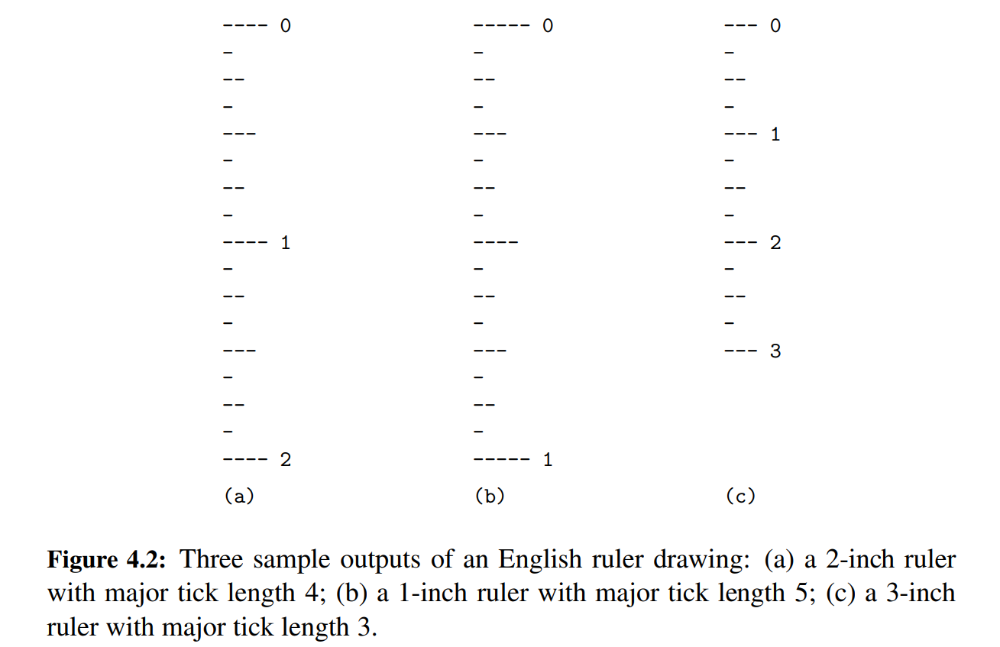
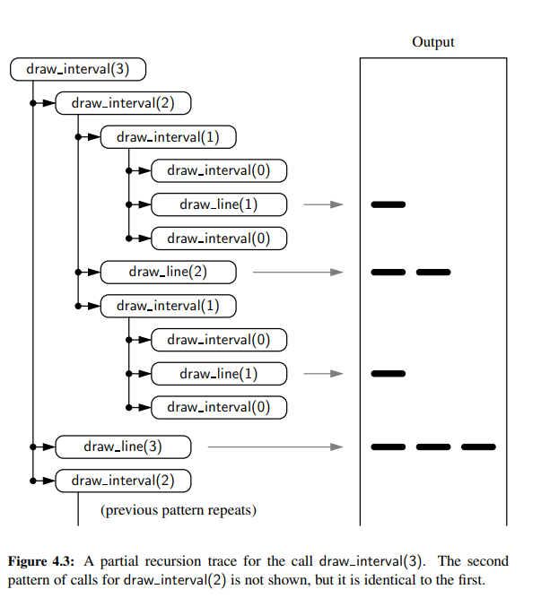

# chapter 4 recursion

One way to describe repetition within a computer program is the use of loops,
such as Python’s while-loop and for-loop constructs. An
entirely different way to achieve repetition is through a process known asrecursion

The process in which a function calls itself directly or indirectly is called recursion and the corresponding function 
is called a recursive function. Using a recursive algorithm, certain problems can be solved quite easily. 
Examples of such problems are Towers of Hanoi (TOH), Inorder/Preorder/Postorder Tree Traversals, DFS of Graph, etc. 
A recursive function solves a particular problem by calling a copy of itself and solving smaller subproblems of 
the original problems. Many more recursive calls can be generated as and when required. 
It is essential to know that we should provide a certain case in order to terminate this recursion process. 
So we can say that every time the function calls itself with a simpler version of the original problem.


This chapter begins with the following four illustrative examples of the use of recursion, providing a Python 
implementation for each.

- The **factorial function** (commonly denoted as n!) is a classic mathematical
function that has a natural recursive definition.
- An **English ruler** has a recursive pattern that is a simple example of a fractal
structure.
- **Binary search** is among the most important computer algorithms. It allows
us to efficiently locate a desired value in a data set with upwards of billions
of entries.
- The **file system** for a computer has a recursive structure in which directories
can be nested arbitrarily deeply within other directories. Recursive algorithms are widely used to explore and manage 
these file systems.

## Factorial Function

Formal definition of factorial function:

$$ n! = \begin{cases} 1 & \text{if } n = 0 \\ n \cdot (n-1) \cdot (n-2) \cdots 2 \cdot 1 & \text{if } n > 0 \end{cases} $$

The recursive formal definition of factorial function can be written as:

$$ n! = \begin{cases} 1 & \text{if } n = 0 \\ n \cdot (n-1)! & \text{if } n > 0 \end{cases} $$

This definition is typical of many recursive definitions. First, it contains one
or more base cases, which are defined non recursively in terms of fixed quantities.
In this case, $n = 0$ is the base case. It also contains one or more recursive cases,
which are defined by appealing to the definition of the function being defined.


Psuedocode for factorial function:

```text
Algorithm factorial(n):
    Input: A nonnegative integer n
    Output: The value n!

    if n = 0 then
        return 1
    else
        return n * factorial(n-1)
```

## English Ruler

The English ruler problem is to draw an English ruler given a number of inches. For
each inch, we place a tick with a numeric label. We denote the length of the tick
designating a whole inch as the major tick length. Between the marks for whole
inches, the ruler contains a series of minor ticks, placed at intervals of 1/2 inch,
1/4 inch, and so on. As the size of the interval decreases by half, the tick length
decreases by one.



Pseudocode for drawing an English ruler:

```text
Algorithm draw_line(tick_length, tick_label=''):
    Draw one line with given tick length (followed by optional label).

Algorithm draw_interval(center_length):
    Draw tick interval based upon a central tick length.

    if center_length > 0 then
        draw_interval(center_length - 1)                 // recursively draw top ticks
        draw_line(center_length)                         // draw center tick
        draw_interval(center_length - 1)                 // recursively draw bottom ticks

Algorithm draw_ruler(num_inches, major_length):
    Draw English ruler with given number of inches, major tick length.

    draw_line(major_length, '0')                         // draw inch 0 line
    for j = 1 to num_inches do
        draw_interval(major_length - 1)                  // draw interior ticks for inch
        draw_line(major_length, str(j))                  // draw inch j line and label
```



## Binary Search

Binary search is a search algorithm that finds the position of a target value within a sorted array. 
It works by repeatedly dividing the array in half, until the target value is found.


Pseudocode for binary search:

```text
Algorithm binary_search(data, target, low, high):
    if low > high then
        return False
    else
        mid = (low + high) // 2
        if target == data[mid] then
            return True
        else if target < data[mid] then
            return binary_search(data, target, low, mid - 1)
        else
            return binary_search(data, target, mid + 1, high)
```

## Designing Recursive algorithms

In general, an algorithm that uses recursion typically has the following form:
- ***Test for base cases***. We begin by testing for a set of base cases (there should
be at least one). These base cases should be defined so that every possible
chain of recursive calls will eventually reach a base case, and the handling of
each base case should not use recursion.
- ***Recur***. If not a base case, we perform one or more recursive calls. This recursive step may involve a test that decides which of several possible recursive
calls to make. We should define each possible recursive call so that it makes
progress towards a base case