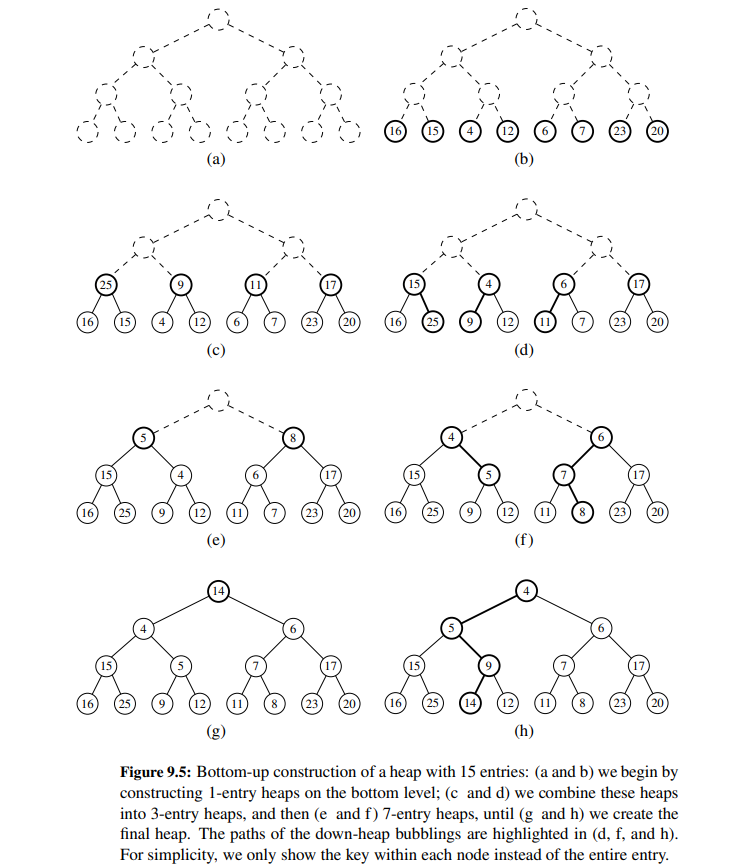
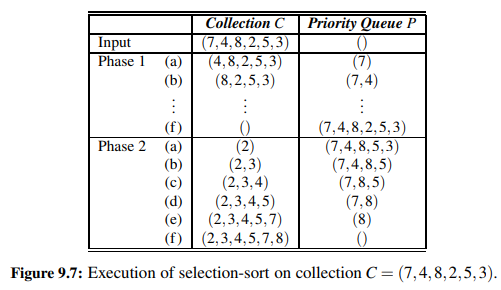

# Chapter 9 Priority Queues

## The Priority Queue Abstract Data Type

In practice, there are many applications in which a queue-like structure is used
to manage objects that must be processed in some way, but for which the first-in,
first-out policy does not suffice. Consider, for example, an air-traffic control center
that has to decide which flight to clear for landing from among many approaching
the airport. This choice may be influenced by factors such as each plane’s distance
from the runway, time spent waiting in a holding pattern, or amount of remaining
fuel. It is unlikely that the landing decisions are based purely on a FIFO policy.

Formally, we model an element and its priority as a key-value pair. We define the priority queue ADT to support the following methods:

* `P.add(k, v)` : Insert an item with key k and value v into priority queue P.
* `P.min()` : Return a tuple (k,v) , representing the key and value of an item of minimum key.
* `P.remove_min()` : Remove an item of minimum key from priority queue P and return a tuple (k,v) , representing the removed key and value.
* `P.is_empty()` : Return True if priority queue P does not contain any items.
* `len(P)` : Return the number of items in priority queue P.

## List Implementation of a Priority Queue

- Composite Design Pattern

It is possible to implement a priority queue using different data structures. 
The composition design pattern is a software design pattern that allows a class to reuse the state and behavior of another class.
In the context of priority queues, the composition design pattern is used to create an abstract data type (ADT) that 
provides the functionality of a priority queue. 

The composition design pattern makes it easy to create different types of priority queues without having to modify the 
underlying data structure. This makes it a versatile and flexible design pattern for implementing priority queues.

### Unsorted List

The unsorted list implementation of a priority queue is the simplest implementation.
We begin with an empty list when a new priority queue is constructed. At all
times, the size of the list equals the number of key-value pairs in the priority queue.

Each time a new key-value pair is added to the priority queue, we create a new _Item composite for the given key and value, 
and append it to the end of the list.
To find the minimum key-value pair, we iterate over the list and return the key-value pair with the smallest key.

Summary of the running times of the unsorted list implementation of a priority queue:

| Operation | Running Time |
| --------- | ------------ |
| `P.add(k, v)` | O(1) |
| `P.min()` | O(n) |
| `P.remove_min()` | O(n) |
| `P.is_empty()` | O(1) |
| `len(P)` | O(1) |

### Sorted List

An alternative implementation of a priority queue uses a positional list, yet maintaining entries sorted by 
nondecreasing keys. This ensures that the first element of the list is an entry with the smallest key.

Summary of the running time of the sorted list implementation of a priority queue:

| Operation | Running Time |
| --------- |--------------|
| `P.add(k, v)` | O(n)         |
| `P.min()` | O(1)         |
| `P.remove_min()` | O(1)         |
| `P.is_empty()` | O(1)         |
| `len(P)` | O(1)         |

## Heaps

Using lists whether sorted or unsorted to implement a priority queue demonstrate an interesting trade-off.

- The sorted list implementation is efficient for finding the minimum key-value pair, but it is inefficient for adding new key-value pairs.
- The unsorted list implementation is efficient for adding new key-value pairs, but it is inefficient for finding the minimum key-value pair.

A more efficient implementation of a priority queue is possible by using a data structure called a binary heap.
This allow allows us to perform both insertion and removal of the minimum key-value pair in O(log n) time.

### Heap data structure

A heap is a binary tree with two additional constraints:

- Heap-order property: In a heap T, for every position p other than the root, the key stored at p is greater 
than or equal to the key stored at p’s parent.

As a consequence of the heap-order property, the smallest key in a heap is always stored at the root.

- Complete binary tree property: A heap T with height h is a complete binary tree if levels $0, 1, 2, ..., h − 1$ of T 
have the maximum number of nodes possible (namely, level `i` has $2^i$ nodes, for $0 \leq i \leq h − 1$) 
and the remaining nodes at level h reside in the leftmost possible positions at that level.

**Proposition:** A heap with $n$ nodes has height $h = \lfloor log n \rfloor$.

**Proof:** The number of nodes in a complete binary tree of height $h$ (so $h+1$ levels) is at least $2^h$ 
(the last level has just one node, the leaf $2^h-1+1=2^h$) and at most $2^{h+1} − 1$ (the last level is full).

Thus, if $n$ is the number of nodes in a heap, we have $2^h \leq n \leq 2^{h+1} − 1$, which implies $h \leq log n \leq h + 1$.
Since $h$ is an integer, we have $h = \lfloor log n \rfloor$.

### Implementing a Heap Priority Queue

We still use the composition design pattern to implement a priority queue using a heap.

**adding an Item to the Heap: ** to perform the `add` operation, the new node should be placed at a position p just 
beyond the rightmost node of the last level of the tree, thus to maintain the complete binary tree property. If the level 
is already full, we add a new level at the bottom of the tree.

**Up heap bubbling: ** after adding a new node to the heap, we may need to swap the new node with its parent, so that 
the heap-order property is maintained. This process is called up-heap bubbling.
Thus, in the worst case, the new node will be swapped with its parent all the way up to the root of the tree. that bound 
is $O(log n)$, where $n$ is the number of nodes in the heap.

**Removing the Minimum Key: ** to perform the `remove_min` operation, we remove the root of the tree, which is the minimum
key in the heap. To maintain the complete binary tree property, we replace the root with the rightmost node on the last
level of the tree. This node is then removed from its original position and placed at the root. This process is called
down-heap bubbling.

**Down heap bubbling: ** after removing the root of the tree, we may need to swap the new root with one of its children,
so that the heap-order property is maintained. 

### Array-Based Representation of a Complete Binary Tree

The array-based representation of a binary tree is a natural way to represent a complete binary tree T. As recall, 
in this representation, we store the nodes of the tree in an array-based list A, such that the element at position p in
T is stored in A with index equal to the level number $f(p)$ of p, defined as follows:

- If p is the root, then $f(p) = 0$.
- If p is the left child of position q, then $f(p) = 2f(q) + 1$.
- If p is the right child of position q, then $f(p) = 2f(q) + 2$.

**Analysis**

Summary of the running times of the heap implementation of a priority queue:

| Operation | Running Time |
| --------- | ------------ |
| `P.add(k, v)` | O(log n) |
| `P.min()` | O(1) |
| `P.remove_min()` | O(log n) |
| `P.is_empty()` | O(1) |
| `len(P)` | O(1) |

### Bottom-Up Heap Construction

If we start with an initially empty heap, n successive calls to the add operation will run in $O(n log n)$ time in the worst case.
However, if all $n$ k-v pairs are already available in a list, we can construct a heap in $O(n)$ time. This is called bottom-up heap construction.

### Python's heapq Module

The heapq module in Python provides a heap-based priority queue implementation with the following methods:

- `heapq.heappush(L, e)` : Push element e onto list L and restore the heap-order property. The function executes in
$O(log n)$ time, where n is the current length of L.
- `heapq.heappop(L)` : Pop the minimum element from list L and restore the heap-order property. The function executes in
$O(log n)$ time.
- `heapq.heappushpop(L, e)` : Push element e onto list L, then pop and return the minimum element from L. The function
executes in $O(log n)$ time. This is equivalent to calling `heapq.heappush(L, e)` followed by `heapq.heappop(L)`, but
more efficient because it does not need to maintain the heap-order property in an intermediate state. If the newly
pushed element e is smaller than the minimum element in L, then the function returns e without popping the minimum element.
Otherwise the new element takes the place of the minimum element in L (at the root of the heap), and the down-heap bubbling
process is applied to restore the heap-order property.
- `heapq.heapreplace(L, e)` : Similar to `heapq.heappushpop(L, e)`, but the function always pops and returns the minimum, 
meaning the new element cannot be directly returned as minimum. The function executes in $O(log n)$ time.
- `heapq.heapify(L)` : Rearrange the elements in list L so that they form a heap. The function executes in $O(n)$ time using
bottom-up heap construction.
- `heapq.nlargest(k, L)` : Return a list of the k largest elements in list L. The function executes in $O(n + k log n)$ time.
- `heapq.nsmallest(k, L)` : Return a list of the k smallest elements in list L. The function executes in $O(n + k log n)$ time.

## Sorting with a Priority Queue

### Selection-Sort and Insertion-Sort

Selection-sort and insertion-sort are two simple sorting algorithms that are based on the priority queue ADT.

**Selection-sort:** The selection-sort algorithm sorts a sequence S by finding the smallest element in S and moving it to the
first position, then finding the second smallest element and moving it to the second position, and so on. The algorithm
uses a priority queue (with unsorted list) to efficiently find the smallest element in S.
The running time of selection-sort is $O(n^2)$, where $n$ is the length of the sequence.

**Insertion-sort:** If we implement the priority queue P using a sorted list, then we improve the running time the min-removal
operation from $O(n)$ to $O(1)$. But the running time of the add operation is $O(n)$, so the overall running time of insertion-sort
is still $O(n^2)$.

### Heap-Sort

Heap-sort is a sorting algorithm that uses a heap to sort a list of numbers. The algorithm uses a priority queue (with heap)
to efficiently find the smallest element in S. The running time of heap-sort is $O(n log n)$, where $n$ is the length of the sequence.
We've seen that the `add` and `remove_min` operations on a heap both run in $O(log n)$ time. Adding $n$ elements to the heap
takes $O(n log n)$ time, but it could be done in $O(n)$ time using bottom-up heap construction. The `remove_min` operation is
called $n$ times, so the total running time of heap-sort is $O(n log n)$.

## Adaptable Priority Queues

In some applications, we need to be able to modify the priority of an item in a priority queue. For example, in a scheduling
application, we may need to change the priority of a task when it is started or paused. In a network application, we may
need to change the priority of a packet when it is retransmitted. In a game application, we may need to change the priority
of a player when it is attacked or healed.

To support these functionalities the simple priority queue ADT is not sufficient. We need to extend the priority queue ADT.

### Implementation using Locators

A locator is a handle for an entry in a priority queue. It is a reference to an entry that can be used to access or modify
the entry. A locator avoids the need to search for an entry in a priority queue when we want to modify it.
The `add` method need to return a locator for the new entry. A locator is needed when invoking the `remove` or `update` methods:

- `P.remove(locator)` : Remove the entry associated with locator from priority queue P and return the key and value of the removed entry.
- `P.update(locator, k, v)` : Update the key and value of the entry associated with locator in priority queue P and return the old key and value.

Summary of performance:

| Operation | Running Time |
| --------- |--------------|
| `P.min()`, `len(P)`, `P.is_empty()` | $O(1)$       |
| `P.add(k, v)` | $O(log n)*$  |
| `P.remove(locator)` | $O(log n)*$  |
| `P.update(locator, k, v)` | $O(log n)$   |
| `P.remove_min()` | $O(log n)*$  |

`*` amortized running time with dynamic array
